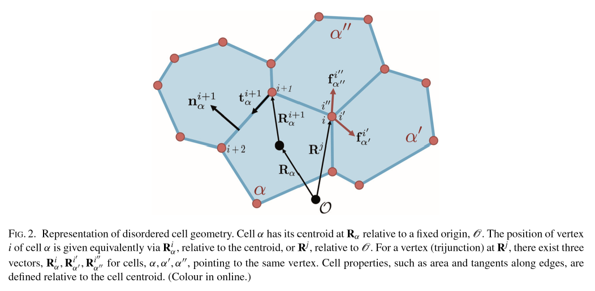
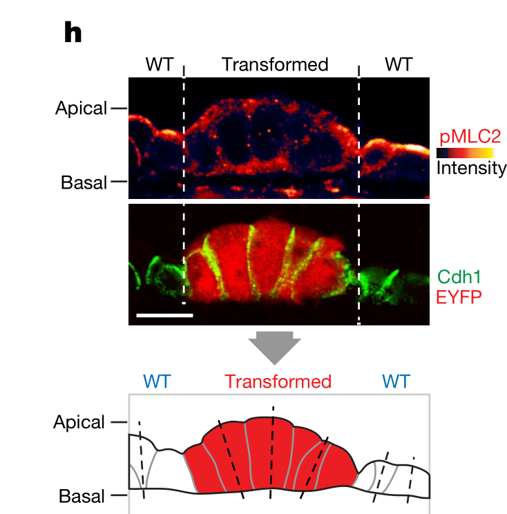
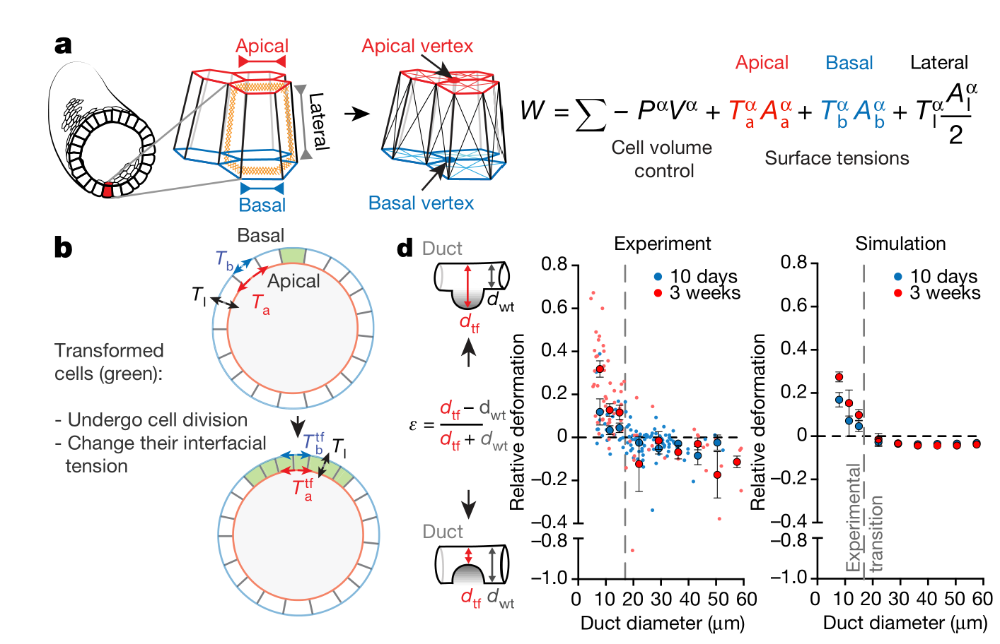
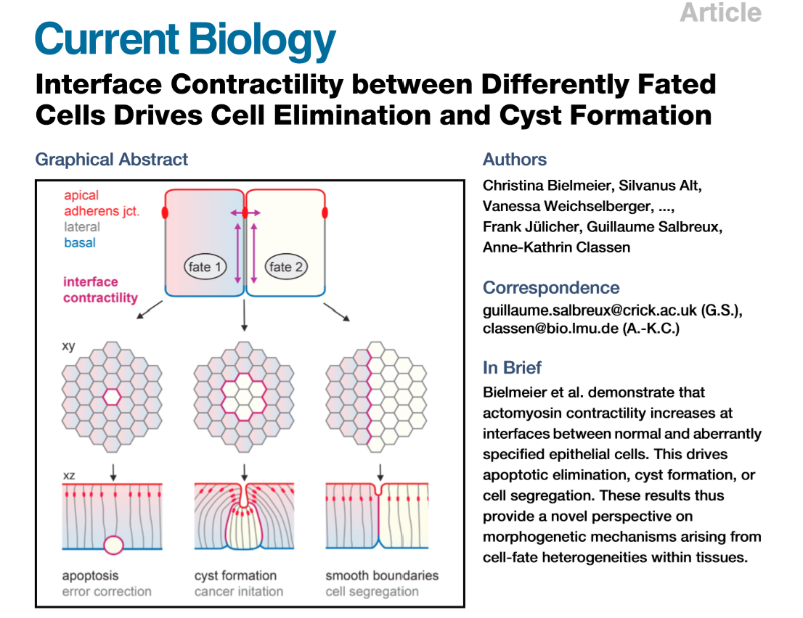
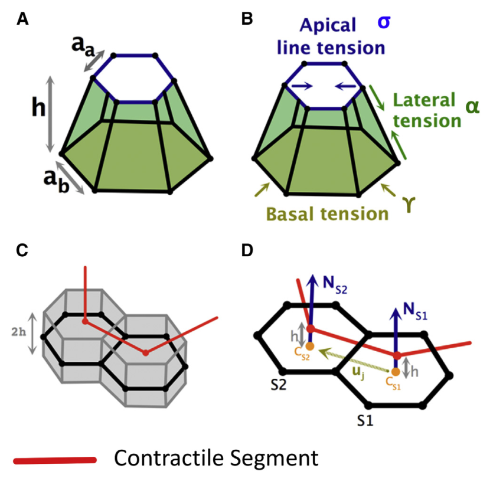
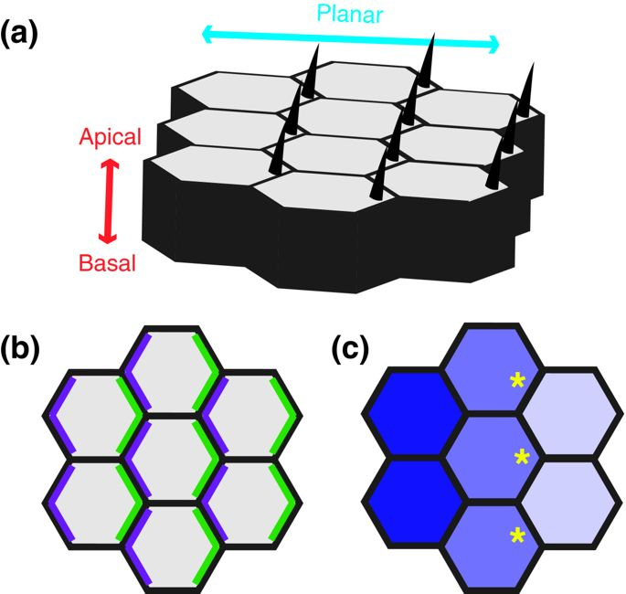

## Giornale

Lavoro di Audoly 3D’( [Misra Audoly et al (2016) Shape Transformations of Epithelial Shells](./0430/BIOPHY~1.PDF) ), perché aggiungono il termine:
$$
E_{b e n d}=\beta \sum\left(\left(1-\mathbf{N}_{S 2\left(j^{\prime}\right)} \cdot \mathbf{N}_{S 1\left(j^{\prime}\right)}\right)-k_{j^{\prime}}\left(-\left(\mathbf{N}_{S 2\left(j^{\prime}\right)}-\mathbf{N}_{S 1\left(j^{\prime}\right)}\right) \cdot \mathbf{u}_{j^{\prime}}\right)\right.
$$

 [Wen et al (2017) Epithelial Folding Driven by Apical or Basal-Lateral
Modulation: Geometric Features, Mechanical
Inference, and Boundary Effects](Biblio RP\1-s2.0-S0006349517305192-main.pdf)  

[RAZ_Krajnc_Matej_i2017.pdf](0514\RAZ_Krajnc_Matej_i2017.pdf) 

[Krajnc et al (2015) Theory of epithelial elasticity](https://sci-hub.tw/https://journals.aps.org/pre/abstract/10.1103/PhysRevE.92.052713)

## 7 maggio

- Rifare i conti del supplementary material di "Tissue curvature and apicobasal mechanical tension imbalance instruct cancer morphogenesis" (cartella 0423), nella sezione che inizia a p. 6. Vedi file: [Nature Volume issue 2019-Suppl-meth.pdf](0423\Nature Volume issue 2019-Suppl-meth.pdf) 

  Alcuni conto sono in [questo file](index.assets\calculations-1-may-2020.pdf) e nel notebook del gruppo tumorgrowth su teams (dominio Roma TRE): [1 may Tissue curvature and apicobasal mechanical tension imbalance instruct cancer morphogenesis](onenote:https://uniroma3.sharepoint.com/sites/Tumorgrowth/SiteAssets/Blocco appunti Tumor growth/Journal.one#1 may Tissue curvature and apicobasal mechanical tension imbalance instruct &section-id=539c1021-1ca0-4d6a-8e37-8ca33f7cc1cd&page-id=27a91b0c-9a5e-42e2-b12f-4d16bcd8031b&end)  ([Visualizzazione Web](https://uniroma3.sharepoint.com/sites/Tumorgrowth/_layouts/15/Doc.aspx?sourcedoc={73059e80-35fe-414d-88bf-8f72b1b0d3e7}&action=view&wd=target(Journal.one|539c1021-1ca0-4d6a-8e37-8ca33f7cc1cd%2F1 may Tissue curvature and apicobasal mechanical tension imbalance instruct |27a91b0c-9a5e-42e2-b12f-4d16bcd8031b%2F)&wdorigin=703&wdpreservelink=1))

-  On p. 49 of the supplementary material of the paper Bielmeier 2016 attempts to perform a passage from the 3D model to the 2d model. 
   Relation between the continuous model and the 3D Vertex Model
   
-  Riferimento gusci: [http://host.uniroma3.it/docenti/tomassetti/sparse_notes%5Cshells_details.html](http://host.uniroma3.it/docenti/tomassetti/sparse_notes\shells_details.html)

## 30 aprile

- [ ] ~~Rifare i calcoli nella sezione Supplementary~~
- [ ] ~~Domanda: c'è qualcosa che Audoly non ha fatto e che noi potremmo fare?~~

 [Misra Audoly et al (2016) Shape Transformations of Epithelial Shells](./0430/BIOPHY~1.PDF) 

 [Misra Audoly et al (2016) Shape Transformations of Epithelial Shells Supplementary materials](0430\98146c6dbe45a96ae6b01dcaa5765a14f95e.pdf) 

## 23 aprile

Paper by [Alexander Nestor-Bergmann](#nestor-bergmann) Mathematical models of morphogen dynamics and growth control.

Tensore dello sforzo singola cellula. 

DPP morfogeno importante, che attiva alcune cellule. Permette di dare segnali 

https://www.intlpress.com/site/pub/pages/journals/items/amsa/content/vols/0001/0002/a006/

Arroyo Roadmap -> il modello 3d vertex ha un fondamento fisico?

 [Arroyo_2020_Epithelial monolayers.pdf](Biblio_AF\Arroyo_2020_Epithelial monolayers.pdf) 

## 16 Aprile

Abbiamo discusso il paper sul 3D vertex.

Paper Schraiman

Tumore epiteliale: 80% tumors

epithelial: racchiude parti di organo

epitelio attaccato a tessuto connettivo

Tumore benigno. Cellule epiteliali al di sotto della membrana basale. Invasione dello stroma

Tumore squamoso. Descritte nel lavoro di PNAS suggerito da me.

le protrusioni non sono meccaniche

## 9 Aprile

Letto articolo [Levayer](./Biblio RP/Levayer_2020_mechanical cell competition in tumour initiation and growth.pdf) 

Compito per il 16 aprile: controllare l'articolo di  [Shraiman](./0416/schraiman2004.pdf)  e l'[articolo originale dove si discute il modello 3D vertex](./0416/bielmeier2016.pdf)

Problema modello: due tessuti con differenti sforzi omeostatici.

# Indice

[TOC]

# Possibili progetti

## 1) Formulazione di teorie di guscio attivi per modellare la crescita cellulare del tessuto epiteliale

Idea: formulare teoria di piastra bifasica con due popolazioni cellulari tra loro in competizione, aventi sforzi omeostatici differenti

- [ ] Controllare paper [Moulton - Goriely](#moultongoriely1) sulla stabilita` dell'omeostasi

- [ ] Controllare il paper [sul tessuto epiteliale pancreatico](#salbreux1) Tissue curvature and apicobasal mechanical tension imbalance instruct cancer morphogenesis
- [ ] Controllare il paper sulle piastre attive
- [ ] Discutere se sia possibile formulare una teoria di crescita direttamente nel contesto della piastra: qual e` l'equivalente di $\mathbf F=\mathbf F_e\mathbf F_p$ per un guscio?
- [ ] Possiamo usare il formato per i gusci che troviamo [qui](http://host.uniroma3.it/docenti/tomassetti/sparse_notes/shells_details.html)?

# Note

[Notes](notes/notes.html)

# Informazioni di carattere generale

### Alcuni estratti dal libro passato da A

#### Epithelial tissues

The majority of human tumors arise from epithelial tissues. Epithelia are sheets of cells that line the walls of cavities and channels or, in the case of skin, serve as the outside covering of the body.  Beneath the epithelial cell layers in each of these tissues lies a *basement membrane*, which separates the epithelial cells from the underlying layer of supporting connective tissue cells, termed the *stroma*.

Epithelia are of special interest here, because they spawn the most common human cancers—the *carcinomas*. These tumors are responsible for more than 80% of the cancer-related deaths in the Western world.

#### Types of epithelial tissues

Some epithelial sheets serve largely to seal the cavity or channel that they line and to protect the underlying cell populations. Tumors that arise from epithelial cells forming these protective cell layers are termed *squamous cell carcinomas*.[^1]

Many epithelia also contain specialized cells that secrete substances into the ducts or cavities that they line. This class of epithelial cells generates *adenocarcinomas*.

The epithelia in some organs such as the lung, uterus, and cervix have the capacity to give rise to pure adenocarcinomas or pure squamous cell carcinomas.[^3]

#### The epithelial–mesenchymal transition (EMT) and stroma invasion

At the borders of many carcinomas, epithelial cancer cells often change shape and gene expression programs and *take on attributes of the nearby stromal cells* of mesenchymal origin. This dramatic shift in cell
phenotype, termed the **epithelial–mesenchymal transition, or simply EMT**, implies great plasticity on the part of cells that normally seem to be fully committed to behaving like epithelial cells. This transition may often accompany and enable the invasion by carcinoma cells into adjacent normal tissues.

To the right is an obvious tumor—an adenocarcinoma—which has begun to invade underlying tissues. (B) This pair of sections, viewed at high magnification, shows how normal tissue architecture becomes eranged in tumors. In the normal human mammary gland (upper panel), a milk duct is lined by epithelial cells (dark purple nuclei). These ducts are surrounded by mesenchymal tissue (see Figure 2.7) termed “stroma,” which
consists of connective tissue cells, such as fibroblasts and adipocytes, and collagen matrix (pink). In an invasive ductal breast carcinoma (lower panel), the cancer cells, which arise from the epithelial cells lining the normal ducts, exhibit abnormally large nuclei (purple), no longer form well-structured ducts, and have invaded the stroma (pink).

[]

The organization of the epithelial cell layers in normal tissues is incompatible with the motility and the invasiveness displayed by malignant carcinoma cells, yet this epithelial organization plan continues to be respected in many primary carcinomas. 

#### Desmoplasia

Desmoplasia originates from the [Ancient Greek](https://en.wikipedia.org/wiki/Ancient_Greek) δεσμός *desmos*, "knot", "bond" and πλάσις *plasis*, "formation". Desmoplasia refers to growth of dense connective tissue or [stroma](https://en.wikipedia.org/wiki/Stroma_(animal_tissue)). It is usually used in the description of [desmoplastic small round cell tumors](https://en.wikipedia.org/wiki/Desmoplastic_small_round_cell_tumor). Desmoplasia it represents an intense fibrotic response characterized by the formation of a dense ECM consisting of increased levels of total fibrillar collagen that accumulates within the tumor. 

Desmoplasia is highly related to tumor stiffening, which is perhaps the only mechanical property of tumors that clinicians can really appreciate. Therefore, the  developed stresses within a tumor depend on the relative stiffness  between the two tissues and from a biomechanical point of view,  stiffening is required for a tumor to be able to displace the host tissue and grow in size (55, 56). Using mathematical modeling we have previously estimated that tumors should be at least 1.5 times stiffer than their surrounding normal tissue, otherwise confinement by the host prevails to tumor expansion (see [journal.pone.0104717.pdf](Biblio_GT\journal.pone.0104717.pdf)).

# Papers

## [Solid stress, competition for space and cancer: The opposing roles of mechanical cell competition in tumour initiation and growth. Romain Levayer](https://www.sciencedirect.com/science/article/pii/S1044579X1930015X)

Some concepts:

- differential sensitivity to mechanical stress
- cell extrusion in epithelial tissues
- EDAC: Epithelial Defense Against Cancer  (Sez. 3)
- Effects of surface tension (Sez. 3)
- Effects of osmotic stress (Sez. 4)
-  [^Hippo pathway] (Sez. 4)
- Mechanical-based and biochemical-based competition
- Genetics and mechanics is mediated by: [^Ras], [^Yki], and [^Scribble mutants]
- Gompertz growth model [?]
- Importanza della morfologia dell'interfaccia tumore-stroma (Sez. 6.2)
- Mentre non appare evidenza di competizione tra stroma e cellule tumorali (Sez. 6.2), c'è invece evidenza a livello intratumorale (Sez. 6.3)
- Riferimento ad articolo di [Schraiman](#schraiman)

Mi pare evidente che se vogliamo studiare la crescita epiteliale gli effetti di bulk e diffusione vanno a farsi benedire. D'altra parte, sembra una scelta più naturale per chi ha un background da strutturista.

==Domanda: Vogliamo fare lo sferoide o la piastra? Sono due problemi completamente differenti.== 

- Per lo sferoide, potremmo studiare l'effetto della instabilità della superficie e lo sviluppo di "fingers"
- Nella piastra si tratterebbe di studiare fenomeni di tipo buckling in cui pero' ci sia un accoppiamento con la crescita. 

### Sez. 2.1. Concetto di crescita differenziale e sforzo omeostatico

Differential growth will build up pressure in the tissue, particularly in the fast growing population and its local environment (Fig. 1A–C). 

![1-s2.0-S1044579X1930015X-gr1[1][2305843009213920170]](index.assets/1-s2.0-S1044579X1930015X-gr1[1][2305843009213920170].jpg)

Intuitively, one would expect that such compression will strongly impair the capacity of the fast growing population to expand.  Here is where Boris Shraiman (http://refhub.elsevier.com/S1044-579X(19)30015-X/sbref0135) introduced the concept of ==differential sensitivity to mechanical stress:== if the neighbouring slow-growing, cells die at lower pressure compared to the fast-growing population, this will be sufficient to trigger preferential elimination of the neighbouring cells. This will lead to space and pressure release and further expansion of the fast growing population (Fig. 1A,D).

Tra le ipotesi che, secondo l'autore, giustificano questo modello, c'è la seguente.

-  **Third, it required that *stress is not dissipated* through cell movements and neighbor exchanges.**

- [ ] Riusciamo a dare un senso a questa affermazione? Che significa, dissipare lo sforzo? 

Dalla discussione che segue sembra che dissipare lo sforzo significhi una sorta di *riarrangiamento del tessuto, mediante deformazioni di tipo plastico, o fenomeni di diffusione*

-  mechanical stress is not dissipated by cell movements and neighbour exchanges

Other theoretical frameworks also proposed a role for mechanics in competitive interactions between cells. This includes the concept of homeostatic pressure introduced by M. Basan et al. [41,42], which assumes the existence of a precise pressure at which cell proliferation and growth is perfectly compensated by cell death (Fig. 1E,F). [...] if one population has a higher homeostatic pressure than another, the former will always
eventually eliminate the later, irrespective of the relative growth rate of the two populations in absence of mechanical constrains. 

- [ ] Nota: a questo riguardo varrebbe la pena di controllare il lavoro di Moulton e Goriely citato sotto.

The assumptions of those models are similar to the one described in Shraiman’s model [*vedi articolo sotto*], namely **that different cell types respond differentially to pressure, and emphasis the role of the balance between proliferation and cell death even in homeostatic tissue.**

### Sez. 2.2. Tissue compaction can trigger cell elimination

[...] a 30% increase of density of [^MDCK] cells led to a rapid increase of the rate of cell extrusion (the
concerted exit of cells from the epithelial layer [44]) and cell death until the tissue reached back its steady state density. 

- [ ] Dunque, un carattere distintivo del tessuto epiteliale è la possibilità di ritornare all'omeostasi mediante espulsione, piuttosto che morte. E` questa una caratteristica che promuove l'invasione?

- [ ] Riusciamo a spiegare questa frase dalla sez. 2.2: [...] For instance, a reduction of cell surface by
  changing the spacing of ECM (Extra Cellular Matrix) spots is sufficient to trigger apoptosis in single endothelial cells [35]

Alternatively, pressures ranging from 1kPa to 100kPa have been applied to 3D cell aggregates (so called
spheroid) either by modulating the elastic modulus of the gel in which cells where embedded [51–53] or by modifying the osmolarity of the external media [30].

- [ ] Nella sezione fa riferimento alla possibilità di indurre sforzo per osmosi. Che cosa significa? Mi pare che ci fosse un riferimento a riguardo nel lavoro di Ambrosi & C.

3D cell compaction can trigger cell death

- [ ] Perche' 3D? Perche' non si riesce a comprimere una piastra senza che questa subisca buckling?

Sez 2.3.

By studying the interactions between Scribble mutants (a regulator of the apico-basal polarity) and
WT MDCK cells, Wagstaff and colleagues observed an active corralling [^corralling] of the mutant cells by the WT cells, which led to Scribble mutan compaction and their elimination [24] (Fig. 2A)

[^MDCK]: **Madin-Darby Canine Kidney** (**MDCK**) **cells** are a model mammalian [cell line](https://en.wikipedia.org/wiki/Cell_line) used in biomedical research. MDCK cells are used for a wide variety of cell biology studies including [cell polarity](https://en.wikipedia.org/wiki/Cell_polarity). Vedi:  https://en.wikipedia.org/wiki/Madin-Darby_Canine_Kidney_cells
[^corralling]: Corralling significa che le cellule si aggregano. In questo caso, come se fossero un gregge.

### Sez. 3.  Effetti di tipo diffusivo e condizioni al contorno [?]

Questa sezione discute altri meccanismi che possono indurre apoptosi, dovuti a fenomeni collettivi non squisitamente meccanici. Questi effetti includono:

- azione compattante di altre cellule, come se fossero "cani pastore"
  [...] Compaction of Scribble mutant cells is also promoted by the active migration of [^WT cells] toward the mutant cells.
- Fenomeni di ordinamento collettivi, quali quelli che si osservano nei nematici:
  [...] MDCK cells tend to align locally similar to nematic liquid crystals. However cell migration
  can generate spontaneous alignment defects (so called +1/2 nematic defects, comet like shape, Fig. 2B)
- effetti di interfaccia, la cui manifestazione è simile a quella prodotta dalla ==tensione superficiale==
  [...] Alternatively, upregulation of tension at the interface of the two cell populations can also generate compressive forces (Fig. 2C). The shape of cellular interfaces in epithelia can be well approximated by the distribution of surface tension [...] Laplace's law for instance can explain the sorting and the formation of smooth boundaries between different cell lineages upon association [60].

- [ ] L'effetto della tensione superficiale potrebbe portare a dinamiche di accrescimento variegate. Nella fase iniziale, la tensione potrebbe essere predominante ed ostacolare il proseguire della crescita. Da capire.

- Sembra che l'autore sia promotore del ruolo della tensione superficiale, dovuta alla presenza di ==cell-misspecification== (vedere anche [Questo lavoro](https://www.ncbi.nlm.nih.gov/pmc/articles/PMC5282066/,) che stabilisce un collegamento con la formazione di cisti) [...] In conclusion, I propose that the modulation of interfacial tension associated with cell misspecification can be at the basis of another mechanical cell competition. While the link between cell compaction,

[^WT cells]: Wild-type cells https://en.wikipedia.org/wiki/Wild_type

- [ ] Capire cosa sono queste WT cells

### Sez. 4. Il ruolo dei segnali biochimici nel "compaction-driven extrusion"

Si tratta di una sezione relativamente difficile da leggere. Discute nel dettagli la relazione tra segnali biochimici e "compattamento" o sforzo, e fa abbondante uso di nomenclatura Bio. 

Un sunto si trova nella seguente tabella:

Sembra che siano importanti questi concetti:

- Piezo1
- Caspases
- l'inibitore Bcl2 
- Hippo pathway [^Hippo pathway]

È ragionevole che una espressione alterata dei geni che regolano questi inibitori sia una delle cause della formazione di masse tumorali.

- [ ] È importante far chiarezza su sta roba?
- [ ] Cosa si intende per "upregulation" e "downregulation"?

- [ ] Non è chiaro cosa si intende per pressione osmotica? Stiamo parlando di poromeccanica?

[...]  Those results suggested that isotropic compaction can elicit the mitochondrial dependent apoptosis pathway and suggest that some sensing mechanisms must relate compression to caspase activity.

### Sez. 5. Sinergia e antagonismo tra meccanismi puramente meccanici e meccanismi biochimici

In questa sezione viene discussa la relazione tra effetti meccanici e altri effetti, mediati da:

- diffusione e mobilità cellulare

- effetti di adiacenza (contatto)

Non mi pare contenga informazioni utili.

- [ ] Sarebbe importante stabilire se dobbiamo tenere conto di questi effetti diffusivi

### Sez. 6.1 Distribuzione dello sforzo nei tumori

In sintesi: il fatto che uno stato di sforzo disomogeneo è la regola nei tumori solidi.

L'interesse non tanto per quello che si dice, che già sapevamo, quanto piuttosto per i riferimenti bibliografici. In particolare, mi sembrano interessanti:

-  un lavoro quantitativo dove viene individuata una relazione tra rigidezza dell'intorno e dimensione di un tumore cresciuto dentro un gel di agar
  [ G. Helmlinger, P.A. Netti, H.C. Lichtenbeld, R.J. Melder, R.K. Jain, Solid stress
  inhibits the growth of multicellular tumor spheroids, Nat. Biotechnol. 15 (1997)
  778–783.](http://refhub.elsevier.com/S1044-579X(19)30015-X/sbref0255)
  
- Lavori dove si studia la distribuzione disomogenea di sforzo dentro lo sferoide. Questi già li avevamo:
  
  [96] T. Stylianopoulos, J.D. Martin, V.P. Chauhan, S.R. Jain, B. Diop-Frimpong,
  N. Bardeesy, B.L. Smith, C.R. Ferrone, F.J. Hornicek, Y. Boucher, et al., Causes,
  consequences, and remedies for growth-induced solid stress in murine and human
  tumors, Proc. Natl. Acad. Sci. U. S. A. 109 (2012) 15101–15108. (in questo c'è anche un modello studiato con FEM)
  
  [97] H.T. Nia, H. Liu, G. Seano, M. Datta, D. Jones, N. Rahbari, J. Incio, V.P. Chauhan,
  K. Jung, J.D. Martin, et al., Solid stress and elastic energy as measures of tumour
  mechanopathology, Nat. Biomed. Eng. 1 (2016).
  
-  Metodi vari per caratterizzare la distribuzione dello stato di sforzo

   [97] H.T. Nia, H. Liu, G. Seano, M. Datta, D. Jones, N. Rahbari, J. Incio, V.P. Chauhan,
   K. Jung, J.D. Martin, et al., Solid stress and elastic energy as measures of tumour
   mechanopathology, Nat. Biomed. Eng. 1 (2016).
   [98] H.T. Nia, M. Datta, G. Seano, P. Huang, L.L. Munn, R.K. Jain, Quantifying solid
   stress and elastic energy from excised or in situ tumors, Nat. Protoc. 13 (2018)
   1091–1105.

- [ ] Vogliamo guardare questi lavori?

### Sez. 6.2. Competizione tumore-stroma

Sunto: non c'è ancora abbastanza evidenza.

The accumulation of solid stress in tumours and in the neighbourin tissue could be compatible with a mechanically-driven elimination of the neighboring cells.

However, there is up to know very few studies reporting apoptosis in vicinity of human tumours. A recent report has depicted cleaved-caspase 3 (Cas3) positive cells in the stroma near human colon tumours, breast tumours, lymph node metastasis, lung tumours and brain tumours [99]. The accumulation of Cas3 positive cells correlated with the levels of c-Myc and the nuclear accumulation of YAP in the tumours. This suggested that the proportion of apoptotic cells near tumours may have been underestimated so far. The low sensitivity of most of the assay to detect apoptosis and the absence of data on the very early phases of tumour expansion may prevent a systematic evaluation of the rate of apoptosis near solid tumours.

The correlation between healthy cell deformation and their elimination was not evaluated, and the contribution of stromal/non-transformed cell death to tumour expansion was never assessed.

### Sez. 6.3. Competizione intratumorale

- estrema variabilità genetica all'interno dello stesso tumore
- discussione di possibili scenari di crescita

While mechanical cell competition between human tumours and the neighbouring healthy cells remains very hypothetical at this stage, there are currently more evidences for the existence of intratumoural
competition (Fig. 4).

Compression-driven elimination can be downregulated by [^Bcl2]  [52], suggesting that the sensitivity to the mitochondrial apoptotic pathway could modulate the sensitivity to compressive stress.

Recent advances in single cell sequencing have revealed a ==high diversity of genetic backgrounds== and very complex clonal dynamics within a tumour [105–107].

[...] Competition for space could prevent the emergence of drug resistant populations if drug-resistant cells have a lower homeostatic pressure and are outcompeted by non-resistant cells in the absence or at low doses of treatment (Fig. 4C). This was theoretically and experimentally validated for [^CDK inhibitors] treatment on colorectal cancer cells [118].

#### Possible scenarios (see figure below):

A: The selection for aggressive clones globally increases the rate of tumour expansion and may favour chemoresitant populations 

B: Spatial competition leads to the elimination of suboptimal, yet highly beneficial clones (green clone,
orange arrows: secreted pro-survival factor). This can lead to tumour collapse if this population is absolutely required for tumour growth/survival. 

C: Spatial competition can lead to the elimination of chemoresistant clones (green clone), especially if they are less competitive in absence of treatment. Adaptive therapy (by alternating treatment and pauses) may lead to the full elimination of the chemoresistant population and eventually tumour disappearance once the resistant cells are fully eliminated. Red arrows show either the relative expansion of the resistant population during treatment or its reduction during pauses.

## [Shraiman: Mechanical feedback as a possible regulator of tissue growth](https://doi.org/10.1073/pnas.0404782102) 

PNAS March 1, 2005 102 (9) 3318-3323; 

## [ALEXANDER NESTOR-BERGMANN: Relating cell shape and mechanical stress in a spatially disordered epithelium using a vertex-based model](http://dx.doi.org/10.1093/imammb/dqx008)

The paper performs the homogenization of the energy of the vertex-based model. This model was introduced in [Honda \& Eguchi, 1980]() , and it assigns to every cell the energy:
$$
\tilde{U}_{\alpha}=\frac{1}{2} \tilde{K}\left(\tilde{A}_{\alpha}-\tilde{A}_{0}\right)^{2}+\frac{1}{2} \tilde{\Gamma} \tilde{L}_{\alpha}^{2}+\frac{1}{2} \tilde{\Lambda} \tilde{L}_{\alpha}
$$
Here $\widetilde A_\alpha$ is the area of the $\alpha$-th cell. Moreover, $\widetilde\Gamma$ is a term accounting for actin-myosin contraction, and $\widetilde\Lambda$ accounts for the surface energy due to cell-cell contact. When lengths are scaled by $\sqrt{\widetilde A_0}$ and suitable dimensionless parameters are introduced, the energy is made dependent on the positions $\mathbf R_\alpha^i$ of the vertices:
$$
U\left(\left\{\mathbf{R}_{\alpha}^{i}\right\} ; \Gamma, \Lambda\right)=\sum_{\alpha=1}^{N_{c}}\left\{\frac{1}{2}\left(A_{\alpha}-1\right)^{2}+\frac{1}{2} \Gamma\left(L_{\alpha}-L_{0}\right)^{2}-U_{0}\right\}
$$
A scheme of notation is the following:

The total force acting on vertex $j$ is
$$
\mathbf{f}^{j}=-\frac{\partial U}{\partial \mathbf R_\alpha^i}=\sum_{\alpha=1}^{N_{c}} \sum_{i=0}^{Z_{\alpha}-1}\left(-P_{\alpha} \mathbf{p}_{\alpha}^{i}+T_{\alpha} \mathbf{q}_{\alpha}^{i}\right) c_{\alpha}^{i j}
$$
where $N_c$ is the number of cells, and $Z_\alpha$ is the number of vertices of cell $\alpha$. The coefficient $c_\alpha^{ij}$ is the element of the connectivity matrix of the graph of vertices when we include only vertices belonging to cell $\alpha$. Moreover, $P_\alpha=A_\alpha-1$ is the pressure of cell $\alpha$ and 
$$
\mathbf{p}_{\alpha}^{i} \equiv \frac{1}{2}\left(\mathbf{n}_{\alpha}^{i}+\mathbf{n}_{\alpha}^{i-1}\right)=\frac{1}{2}\left(\mathbf{R}_{\alpha}^{i+1}-\mathbf{R}_{\alpha}^{i-1}\right) \times \hat{\mathbf{z}}
$$
 gives the direction of the bulk compressive force at node $i$ (due to the pressure of the cell $\alpha$); the other term $T_{\alpha} \equiv \Gamma\left(L_{\alpha}-L_{0}\right)$ gives the tension in the perimeter of cell $\alpha$ whose direction is $\mathbf{q}_{\alpha}^{i} \equiv \hat{\mathbf{t}}_{\alpha}^{i}-\hat{\mathbf{t}}_{\alpha}^{i-1}$, the difference between the unit tangent vectors obtained by renormalizingthe differences ${\mathbf{t}}_{\alpha}^{i}={\mathbf{R}}_{\alpha}^{i+1}-{\mathbf{R}}_{\alpha}^{i}$. 

In addition, each node experiences a viscous drag of the form
$$
\mathbf f^j_v=-\left(\frac{A_{\alpha}}{Z_{\alpha}}+\frac{A_{\alpha^{\prime}}}{Z_{\alpha^{\prime}}}+\frac{A_{\alpha^{\prime \prime}}}{Z_{\alpha^{\prime \prime}}}\right) \dot{\mathbf{R}}^{j}
$$
where the ratio $A_\alpha/Z_\alpha$ is the area per each vertex of the $\alpha$-th cell. **This choice has the advantage that the total viscous force acting on each cell is proportional to its area and to the velocity of its centroid**.

A notion of stress is introduced, which is associated to each cell, and is constructe by way of analogy with Signorini's average theorem:
$$
\int_{\mathscr{A}} \sigma \mathrm{d} A=\int_{\mathscr{A}} \nabla \cdot(\mathbf{R} \otimes \sigma) \mathrm{d} A=\oint_{\mathscr{S}} \mathbf{R} \otimes \sigma \cdot \mathbf{n} \mathrm{d} S
$$
In the present setting, the analogue to that formula is 
$$
A_{\alpha} \sigma_{\alpha}=\sum_{i=0}^{Z_{\alpha}-1} \mathbf{R}_{\alpha}^{i} \otimes\left(\mathbf{f}_{\alpha}^{i}-\left(A_{\alpha} / Z_{\alpha}\right)\left(\dot{\mathbf{R}}_{\alpha}+\dot{\mathbf{R}}_{\alpha}^{i}\right)\right)=\sum_{i=0}^{Z_{\alpha}-1} \mathbf{R}_{\alpha}^{i} \otimes \mathbf{f}_{\alpha}^{i}-\left(A_{\alpha} / Z_{\alpha}\right) \sum_{i=0}^{Z_{\alpha}-1} \mathbf{R}_{\alpha}^{i} \otimes \dot{\mathbf{R}}_{\alpha}^{i}
$$
Eventually, the stress is expressed as
$$
\boldsymbol{\sigma}_{\alpha}=-P_{\alpha}^{\mathrm{eff}}\mathbf I+T_{\alpha} \mathbf{J}_{\alpha}-\frac{1}{2} \dot{\mathbf{S}}_{\alpha},
$$
where 
$$
P_{\alpha}^{\mathrm{eff}}=P_{\alpha}+\frac{T_{\alpha} L_{\alpha}}{2 A_{\alpha}},\qquad\mathbf J_{\alpha}=\frac{1}{A_{\alpha}}\left(\frac{1}{2} L_{\alpha} \mathbf I-\sum_{i=0}^{Z_{\alpha}-1} l_{\alpha}^{i} \hat{\mathbf{t}}_{\alpha}^{i} \otimes \hat{\mathbf{t}}_{\alpha}^{i}\right)\qquad  \mathbf S_\alpha=\frac 1 {Z_\alpha}\sum_{i=0}^{Z_\alpha-1}\mathbf R_\alpha^i\otimes\mathbf R_\alpha^i
$$
are the *effective pressure*, the *derivatoric part of the stress*, and the *shape tensor*. Recall that $\ell_\alpha^i$ is the length of the $i$-th edge of cell $\alpha$ (the number of edges equals the number of vertices).

The final result is a 

## [Tumour heterogeneity promotes collective invasion and cancer metastatic dissemination](http://rsos.royalsocietypublishing.org/content/4/8/161007) 

A Hallou, J Jennings and AJ Kabla,    R. Soc. Open Sci.   4   161007   (2017)

 Heterogeneity within tumour cell populations is commonly observed in most cancers. However, its impact on metastatic dissemination, one of the primary determinants of the disease prognosis, remains poorly understood. Working with a **simplified numerical model of tumour spheroids**, we investigated the impact of mechanical heterogeneity on the onset of tumour invasion into surrounding tissues. Our work establishes a positive link between tumour heterogeneity and metastatic dissemination, and recapitulates a number of invasion patterns identified *in vivo*, such as multicellular ==**finger-like protrusions**==. 

Two complementary mechanisms are at play in heterogeneous tumours. A small proportion of stronger cells are able to **initiate and lead the escape of cells**, while **collective effects in the bulk** of the tumour provide the coordination required to sustain the invasive process through multicellular streaming. This suggests that the multicellular dynamics observed during metastasis is a generic feature of mechanically heterogeneous cell populations and might rely on a limited and generic set of attributes.

## [Tissue curvature and apicobasal mechanical tension imbalance instruct cancer morphogenesis](Biblio RP\Nature Volume issue 2019  Tissue curvature and apicobasal mechanical tension imbalance instruct can.pdf)

- [Guillaume Salbreux](https://www.crick.ac.uk/research/labs/guillaume-salbreux\) 
- [Axel Behrens](https://www.nature.com/articles/s41586-019-0891-2#auth-8) 

Tubular epithelia are a basic building block of organs and a common site of cancer occurrence. During tumorigenesis, transformed cells overproliferate and epithelial architecture is disrupted. However, the biophysical parameters that underlie the adoption of abnormal tumour tissue shapes are unknown. Here we show in the pancreas of mice that the morphology of epithelial tumours is determined by the interplay of cytoskeletal changes in transformed cells and **the existing tubular geometry**. To analyse the morphological changes in tissue architecture during the initiation of cancer, we developed a three-dimensional whole-organ imaging technique that enables tissue analysis at single-cell resolution. Oncogenic transformation of pancreatic ducts led to two types of neoplastic growth: exophytic lesions that expanded outwards from the duct and endophytic lesions that grew inwards to the ductal lumen. Myosin activity was higher apically than basally in wild-type cells, but upon transformation this gradient was lost in both lesion types. Three dimensional vertex model simulations and a **continuum theory of epithelial mechanics**, which incorporate the cytoskeletal changes observed in transformed cells, indicated that **the diameter of the source epithelium instructs the morphology of growing tumours**. Three-dimensional imaging revealed that - consistent with theory predictions-small pancreatic ducts produced exophytic growth, whereas large ducts deformed endophytically. 

The main experimental observation reported in the paper is that 

- transformed ducts with a diameter of less than 17 μm deformed exophytically, i.e., bulge outside, whereas 

- ducts with a diameter of greater than 17 μm deformed endophytically.

 -  [Supplementary material on the 3d vertex model](https://static-content.springer.com/esm/art%3A10.1038%2Fs41586-019-0891-2/MediaObjects/41586_2019_891_MOESM1_ESM.pdf)

## [Murisic, Hakim, Audoly (2015)](http://www.lps.ens.fr/~hakim/15biophysj.pdf), where homogenization is discussed in a purely 2D context.

$$
\mathcal{E}_{\mathrm{vm}}=\frac{1}{2} \sum_{f}\left(A_{f}-1\right)^{2}+G \sum_{e} L_{e}+\frac{H}{2} \sum_{f} P_{f}^{2}+B \sum_{e^{\prime}}\left(1-\mathbf{N}_{f_{1}\left(e^{\prime}\right)} \cdot \mathbf{N}_{f_{2}\left(e^{\prime}\right)}\right)
$$

## Bielmeier: Interface Contractility between differently fated cells drives cell elimination and cyst formation.

[Bielmeier et al 2016. ](https://www.pks.mpg.de/fileadmin/user_upload/MPIPKS/group_pages/BiologicalPhysics/juelicher/publications/2016/ICbDFCDCEaCF2016.pdf)

This is the original paper where the 3D vertex model is discussed. There is also a calculation concerning

## Mechanics of active surfaces (Salbreux)

[salbreux2017.pdf](Biblio_GT\salbreux2017.pdf) 

## [Misra et al (2016). Shape Transformations of Epithelial Shells](https://www.sciencedirect.com/science/article/pii/S0006349516300583)

[MahimMisra](https://www.sciencedirect.com/science/article/pii/S0006349516300583#!) [BasileAudoly](https://www.sciencedirect.com/science/article/pii/S0006349516300583#!) [Ioannis G.Kevrekidis](https://www.sciencedirect.com/science/article/pii/S0006349516300583#!) [Stanislav Y.Shvartsman](https://www.sciencedirect.com/science/article/pii/S0006349516300583#!)

## [Moulton & Goriely: Stability of homeostasis]( https://link.springer.com/article/10.1007/s11538-018-0502-7 )

[Questo lavoro](https://royalsocietypublishing.org/doi/10.1098/rsif.2019.0233) contiene dei riferimenti al problema della stabilità della crescita. Di particolare interesse è la Sezione 5, dal titolo *Mechanobiological instabilities*. In particolare, la formula
$$
\begin{aligned}
&\boldsymbol{F}^{\mathrm{g}-1} \cdot \dot{\boldsymbol{F}}^{\mathrm{g}}=\boldsymbol{K}:\left(\boldsymbol{\sigma}-\boldsymbol{\sigma}^{\mathrm{h}}\right)
\end{aligned}
$$
che stabilisce la dipendenza della velocità di accrescimento $\dot{\boldsymbol F}^g$ dallo stato di sollecitazione. Il lavoro contiene degli ulteriori riferimenti:

- Studies using the constrained mixture theory of §[3](javascript:popRef('s3')) similarly use methods from dynamical systems, for example stability analyses, but in terms of different characteristic equations [[96](https://royalsocietypublishing.org/doi/10.1098/rsif.2019.0233#RSIF20190233C96),[98](https://royalsocietypublishing.org/doi/10.1098/rsif.2019.0233#RSIF20190233C98)–[100](https://royalsocietypublishing.org/doi/10.1098/rsif.2019.0233#RSIF20190233C100)]. In particular, consistent with equations (3.2)–(3.4), the focus turns towards rates of change in mass (equivalently, referential mass density

Tra questi, c'è un lavoro di Moulton e Goriely che sembra semplice da leggere.

## Cell surface mechanics and the control of cell shape, tissue patterns and morphogenesis

Thomas Lecuit and Pierre-François Lenne

The plasma membrane is decorated by microscopic wrinkles and folds, which constitute a significant reservoir of molecules that are readily available for a change in its apparent surface area and its surface of contact with other cells. lthough the surface tension of  a liquid is constant, apparent cell surface tension can depend on the cell surface area.

- Shaping isolated cells by cortical tension.
- Adhesion controls the shape of contacting cells. 
- Interplay between adhesion and cortical tension.

# Persone

## [Frank Joelicher](https://www.pks.mpg.de/biological-physics/frank-juelicher/)

https://www.crick.ac.uk/news/2020-03-19_meet-our-newest-group-leaders

## [Vincent Hakin](http://www.lps.ens.fr/~hakim/)

## [Adrien Hallou](https://www.tcm.phy.cam.ac.uk/profiles/ah691/) (Cambridge)

- **On growth and force: mechanical forces in development**  A Hallou and T Brunet,    [   Development   147(4)   dev187302 (2020) ](Biblio_GT\10.1242@dev.187302.pdf) 

- ==**Theory of mechano-chemical patterning in biphasic biological tissues**  P Recho, A Hallou and E Hannezo,  [   PNAS   116(12)   5344 (2019) ](https://doi.org/10.1073/pnas.1813255116)== 

## [Alexander Nestor-Bergmann](https://alexander-nestor-bergmann.github.io/)

# Vertex models

Vertex models are based on the assumption that the energy of a cell complex be the sum over the cells $\alpha$ comprising the tissue of a specific energy per cell. 
$$
E=\sum_\alpha\frac{1}{2} \tilde{K}\left(\tilde{A}_{\alpha}-\tilde{A}_{0}\right)^{2}+\frac{1}{2} \tilde{\Gamma} \tilde{L}_{\alpha}^{2}+\frac{1}{2} \tilde{\Lambda} \tilde{L}_{\alpha}
$$
The first term takes into account the incompressibility of the cytoplasm.

The second term accounts for cortical tension.i.ei. the apparent cell surface tension due to the contractile microfilaments of the cell cortex and their interaction with the membrane.

# Materiale non ordinato e forse inutile

### Sogno nel cassetto: modelli macroscopici microscopicamente informati di motilità cellulare basati su potenziali pseudo-termodinamici (stochastic thermodynamics).

#### The homeostatic ensemble for cells](https://link.springer.com/article/10.1007%2Fs10237-018-1048-1)

A very large number of complex interlinked metabolic reactions such as (but not restricted to) ion pumps, osmosis, diffusion and cytoskeletal reactions operate to actively regulate the concentration of species within the cell.

Energy for the active processes is obtained mainly from the hydrolysis of ATP and ultimately from glucose furnished by the nutrient bath.

Remarkably, these processes maintain the concentrations of all species within the cell to be very nearly constant over a sustained period of time (e.g. the interphase period of the cell cycle). This phenomenon is known as **cellular homeostasis** (Weiss [1996](https://link.springer.com/article/10.1007/s10237-018-1048-1?shared-article-renderer#ref-CR82)).

#### [Wasserstein metric](https://ncatlab.org/nlab/show/Wasserstein+metric) 

#### Lecture notes by Deshpande

https://www.dropbox.com/sh/xp4zdk3lafqfefg/AACwD8Z7wr9NDiqwVmv8mAeZa?dl=0

### Stochastic thermodynamics

https://arxiv.org/pdf/1903.08115.pdf

https://www.math.uci.edu/~lowengrb/RESEARCH/tumor.php

# Glossario

[^1]:  Normal squamous cells are often flattened and function to protect the epithelium and underlying tissue from the contents of the lumen or, in the case of skin, from the outside world. The squamous epithelia of the cervix of the uterus (left) and the skin (right) are organized quite similarly, with mature flattened cells at the surface being continually shed (for example, the dead keratinocytes of the skin) and replaced by less differentiated cells that move upward and proceed to differentiate.
[^2]: Mesenchymal: (1) Referring to tissue composed of cells of mesodermal origin, including fibroblasts, smooth muscle cells, endothelial cells, and immunocytes; (2) Referring to an individual cell type belonging to this class of cells.
[^3]: The epithelia of the lungs, liver, gallbladder, pancreas, esophagus, stomach, and intestines all derive from the inner cell layer, the endoderm. Skin arises from the outer embryonic cell layer, termed the ectoderm, while the ovaries originate embryologically from the middle layer, the mesoderm.

[^Agar]: [Agar](https://en.wikipedia.org/wiki/Agar) is used as a solid [substrate](https://en.wikipedia.org/wiki/Substrate_(biology)) to contain [culture media](https://en.wikipedia.org/wiki/Growth_medium) for [microbiological](https://en.wikipedia.org/wiki/Microbiology) work.  An agar plate or [Petri dish](https://en.wikipedia.org/wiki/Petri_dish) is used to provide a [growth medium](https://en.wikipedia.org/wiki/Growth_medium) using a mix of agar and other nutrients in which microorganisms, including [bacteria](https://en.wikipedia.org/wiki/Bacteria) and [fungi](https://en.wikipedia.org/wiki/Fungi), can be cultured and observed under the microscope. 

[^Apoptosis]: [Apoptosis](https://en.wikipedia.org/wiki/Apoptosis) can be initiated through one of two pathways. In the *intrinsic pathway* the cell kills itself because it senses [cell stress](https://en.wikipedia.org/wiki/Cellular_stress_response), while in the *extrinsic pathway* the cell kills itself because of signals from other cells.
[^ ARP2/3 complex ]:

[^Bcl2]: [Bcl2]() Apoptosis inhibitor correlated to Hyppo

[^Clone]:
[^Caspases]: [Caspases](https://en.wikipedia.org/wiki/Caspase) (**c**ysteine-**asp**artic prote**ases**, **c**ysteine **asp**art**ases** or **c**ysteine-dependent **asp**artate-directed prote**ases**) are a family of protease enzymes playing essential roles in [programmed cell death](https://en.wikipedia.org/wiki/Programmed_cell_death) (including [apoptosis](https://en.wikipedia.org/wiki/Apoptosis), [pyroptosis](https://en.wikipedia.org/wiki/Pyroptosis) and [necroptosis](https://en.wikipedia.org/wiki/Necroptosis)) and [inflammation](https://en.wikipedia.org/wiki/Inflammation). They are named caspases due to their specific [cysteine protease](https://en.wikipedia.org/wiki/Cysteine_protease) activity – a cysteine in its active site [nucleophilically](https://en.wikipedia.org/wiki/Nucleophilic_catalysis) attacks and cleaves a target protein only after an [aspartic acid](https://en.wikipedia.org/wiki/Aspartic_acid) residue. As of 2009, there are 11 or 12 confirmed caspases in humans[[note 1\]](https://en.wikipedia.org/wiki/Caspase#cite_note-Saleh2004-3) and 10 in mice, carrying out a variety of cellular functions.
[^CDK inhibitors]: A [cyclin-dependent kinase inhibitor](https://en.wikipedia.org/wiki/Cyclin-dependent_kinase_inhibitor_protein) (CKI) is any chemical that inhibits the function of [CDKs](https://en.wikipedia.org/wiki/Cyclin-dependent_kinase). They are used to treat [cancers](https://en.wikipedia.org/wiki/Cancer) by preventing overproliferation of cancer [cells](https://en.wikipedia.org/wiki/Cell_(biology)). The US FDA approved the first drug of this type, [palbociclib](https://en.wikipedia.org/wiki/Palbociclib) (Ibrance),[[1\]](https://en.wikipedia.org/wiki/CDK_inhibitor#cite_note-1) a [CDK4](https://en.wikipedia.org/wiki/CDK4)/[6](https://en.wikipedia.org/wiki/CDK6) inhibitor, in February 2015, for use in postmenopausal women with breast cancer that is [estrogen receptor](https://en.wikipedia.org/wiki/Estrogen_receptor) positive and [HER2 negative](https://en.wikipedia.org/wiki/HER2_negative). Several compounds are in clinical trials.
[^Cortical tension]: The apparent cell surface tension due to the contractile microfilaments of the cell
cortex and their interaction with the membrane.

[^Entosis]: intrappolamento di una cellula da parte del suo intorno

[^Gompertz growth model]: [Gompertz growth model]()

[^Hippo pathway]:  [Hippo pathway]() is a central regulator of cell growth and cell survival and is one of the best documented examples of pathways modulated by cell shape and cell mechanics [3]. Hippo pathway is *inhibited by cell stretching* [28,75,76],

[Tissue homeostasis]:  The property of biological tissues to remain structurally and functionally stable in a changing physiological environment.

[^JNK pathways]: 

[^Myc]: This proto-oncogene is a regulator of contact dependent competition. It is triggered by Yki activation.

[^Myosin II]: https://en.wikipedia.org/wiki/Myosin#Myosin_classes

[^MLC]: https://en.wikipedia.org/wiki/Myosin_light-chain_kinase
[^PCP proteins]: Planar Cell Polarity

[^Ras]:[Ras](https://it.wikipedia.org/wiki/Ras_(proteina)) (Oncogene).  è il nome dato a una famiglia di [proteine](https://it.wikipedia.org/wiki/Proteine) correlate, trovate all'interno delle [cellule](https://it.wikipedia.org/wiki/Cellula), comprese le cellule umane. Tutti i membri della famiglia delle proteine Ras appartengono ad una classe di proteine chiamate piccole [GTPasi](https://it.wikipedia.org/wiki/GTPasi) (*small GTPase*), e sono coinvolte nella [trasmissione di segnali all'interno delle cellule](https://it.wikipedia.org/wiki/Segnale_cellulare). Quando Ras è *"attivato"* da segnali in arrivo, esso si trasferisce successivamente su altre proteine che, in ultima analisi, attivano i geni coinvolti in crescita cellulare, differenziazione e sopravvivenza. Come risultato le mutazioni nei geni Ras possono portare alla produzione di proteine Ras permanentemente attive. Ciò può causare segnalazioni indesiderate e iperattive all'interno della cellula, anche in assenza di segnali in ingresso. Poiché questi segnali conducono a crescita e divisione cellulare, un segnale Ras iperattivo in ultima analisi può portare al [cancro](https://it.wikipedia.org/wiki/Neoplasia)[[1\]](https://it.wikipedia.org/wiki/Ras_(proteina)#cite_note-pmid10394594-1) . L'oncogene Ras è il più comune nei tumori umani. Mutazioni che attivano in modo permanente Ras si riscontrano nel 20-25% di tutti i tumori umani e fino al 90% in alcuni tipi di tumore, ad esempio pancreatici[[2\]](https://it.wikipedia.org/wiki/Ras_(proteina)#cite_note-pmid12509763-2).   L'origine del nome Ras è l'abbreviazione di *Rat sarcoma*, [sarcoma](https://it.wikipedia.org/wiki/Sarcoma) del [ratto](https://it.wikipedia.org/wiki/Rattus), che riflette il modo in cui sono stati scoperti i primi membri della famiglia proteica. Il nome *ras* è anche usato per riferirsi alla famiglia di [geni](https://it.wikipedia.org/wiki/Gene) che codificano per queste proteine.

[^Scribble mutants]: Scribble mutants

[^upregulation]:

[^Yap]: 

[^Yki]:

